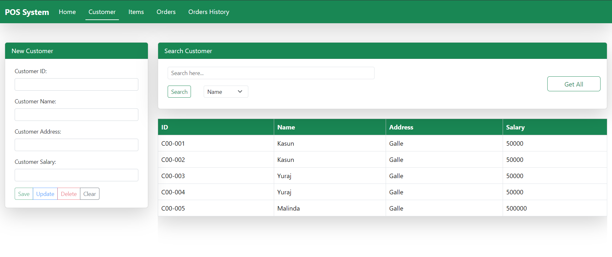
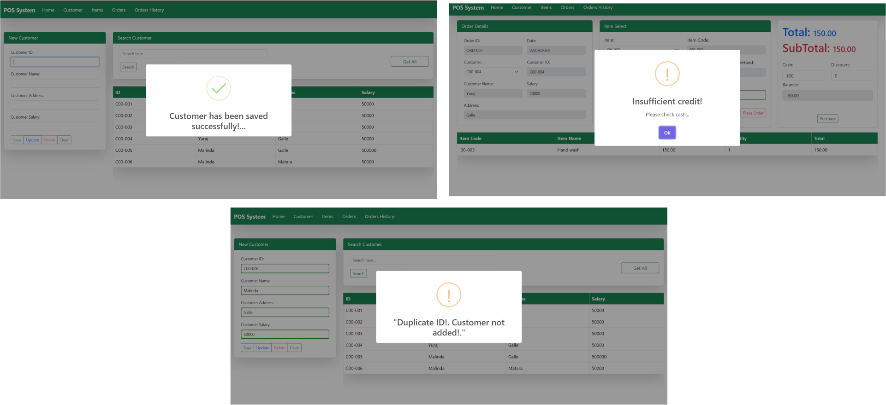
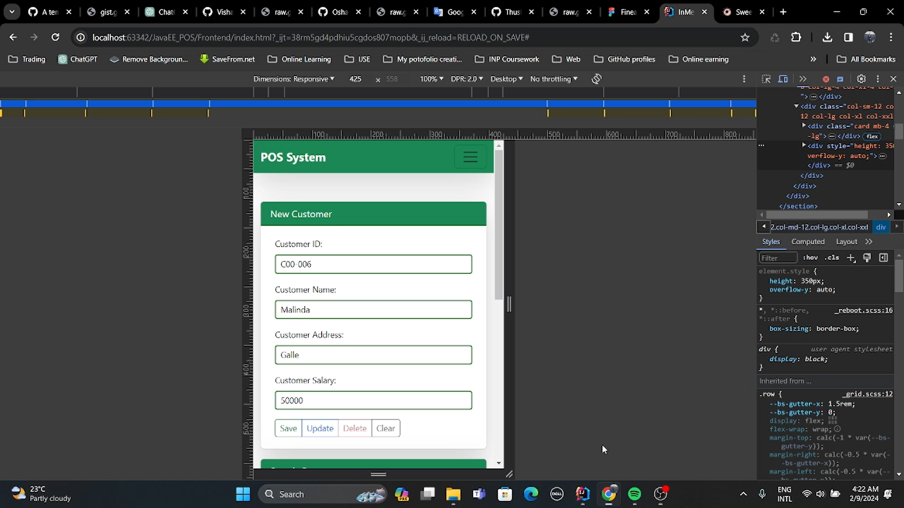

# CyberCart POS - JavaEE Backend
A CyberCart (Point of Sale) application is a versatile online tool that empowers businesses to efficiently handle their sales transactions. This intuitive software operates through a web browser, providing a seamless experience for managing orders, items and maintaining a centralized system for customer information. This project serves as an educational resource to enhance understanding of Java EE development.
## Project Components
### Front-end
The front-end of a website or application is the user interface that users interact with. It includes the design, layout, and features visible to the user, providing a seamless and visually appealing experience. The front-end uses HTML, CSS, jQuery, and AJAX to create a dynamic and responsive web application.
### Back-end
The backend is the behind-the-scenes technology responsible for server-side and data management operations. It includes databases, server logic, and application architecture, handling tasks such as data processing, server communication, and business logic. The back-end of the POS system is implemented using JavaEE and is configured to run on the Apache Tomcat server.
### Features
1. User-friendly interface :-- Intuitive design for easy navigation and quick learning. Built with using HTML, CSS, Bootstrap framework.
     
   
     
2. Reporting and Analytics :-- Generation of detailed alerts on sales, inventory, and customer data for informed decision-making. Built with <a href="https://sweetalert2.github.io/">SweetAlert2</a> library.
     
   
     
3. Mobile Accessibility :-- Responsive design or dedicated mobile apps for managing POS activities on smartphones or tablets.
     
   
     
4. JavaEE Architecture :-- Built using the Java Platform, Enterprise Edition, providing a robust and scalable architecture for enterprise-level applications.
5. Apache Tomcat Server :-- Configured to run on the Apache Tomcat server, ensuring reliable and efficient web application hosting. 
6. Data Processing :-- Implements server-side logic for handling data processing, facilitating seamless communication between the front-end and database. 
7. Business Rules :-- Incorporates business rules to enforce logic and regulations specific to the Point of Sale domain. 
8. Database Interactions :-- Manages interactions with the database, ensuring data integrity and security.
## Getting Started
To run the POS system backend locally, follow these steps :
1. First, you need to clone this repository to your local machine.
2. To do that, Right-click where you want to clone this repository and then click `git bash`.
3. Then, enter this command, `git clone https://github.com/YurajMalinda/AAD-Assignment---JavaEE.git`.
4. Set up your JavaEE development environment and ensure Apache Tomcat 9.0.83 is installed.
5. In the Deployment, set the **Application Context** to `/backend`. 
6. Build and deploy the application to your Apache Tomcat server.
7. Access the POS system backend at http://localhost:8080/backend.
## Tech Stack
**Front-end :**-

- HTML
- CSS
- Bootstrap
- JQuery
- AJAX

**Back-end :**

- JavaEE
- Apache Tomcat

**Database :**

- MySQL Connector : Java-based driver for connecting to MySQL databases. (Versoin 8.0.32).
- Java Naming and Directory Interface (JNDI): Java API for connecting to directory services, used for managing database connections efficiently through connection pooling, enhancing performance and scalability.

**Development Tools :**

- Maven : Build automation and project management tool. (Version 4.0.0).
  

  
  
  
  
  
  

## System Tour
- Watch this video!

## Contributing

Contributions are welcome! Please follow our contribution guidelines to get started.

## License
This project is licensed under the [MIT License](LICENSE). 
See the [LICENSE] (https://github.com/YurajMalinda/AAD-Assignment---JavaEE/blob/main/LICENSE) file for details.  
© 2024 All Right Reserved, Designed By [Yuraj Malinda](https://github.com/YurajMalinda)

